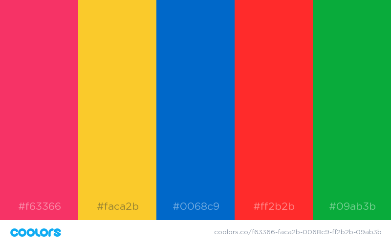

# Theme Essentials

- [Theme Essentials](#theme-essentials)
  - [Main Colors](#main-colors)
  - [Other Secondary Colors](#other-secondary-colors)
  - [Fonts](#fonts)
  - [Details](#details)
    - [SCSS Variables](#scss-variables)
    - [Bootstrap](#bootstrap)

## Main Colors

These colors are used throughout streamlit applications as of Feb 2, 2020.

| Name           | Hex       | Use                                                      |
| -------------- | --------- | -------------------------------------------------------- |
| Primary        | `#f63366` | Primary pink/magenta used for widgets throughout the app |
| Secondary      | `#f0f2f6` | Background color of Sidebar                              |
| Black          | `#262730` | Font Color                                               |
| Yellow (Light) | `#fffd80` | Right side of top header decoration in app               |
| White          | `#ffffff` | Background                                               |

<br>

<details>

<summary>View Colors</summary>

[](https://coolors.co/f63366-f0f2f6-262730-fffd80-ffffff)

</details>

## Other Secondary Colors

These are defined in the `variables.scss` file [described below](#details), but are not heavily used within the streamlit applications.

| Name   | Hex       |
| ------ | --------- |
| Red    | `#ff2b2b` |
| Yellow | `#faca2b` |
| Blue   | `#0068c9` |
| Green  | `#09ab3b` |

<br>

<details>

<summary>View Colors</summary>

[](https://coolors.co/f63366-faca2b-0068c9-ff2b2b-09ab3b)

</details>

## Fonts

Streamlit's default fonts are from the [`IBM Plex Collection`](https://fonts.google.com/featured/Plex?selection.family=IBM+Plex+Sans:700)

Text, including headers and markdown, is in [`IBM Plex Sans`](https://fonts.google.com/specimen/IBM+Plex+Sans).

Code and data use [`IBM Plex Mono`](https://fonts.google.com/specimen/IBM+Plex+Mono) as the monospace font. This is used in markdown `code` blocks, the use of `st.echo()`, widget labels, `st.json()`, and rendered dataframes via `st.dataframe` and `st.table`.


## Details

### SCSS Variables

The essential aspects of streamlit's theme can be found in the [`variables.scss`](https://github.com/streamlit/streamlit/blob/develop/frontend/src/assets/css/variables.scss) file in the frontend assets folder in the streamlit repository.

The essentials of the file are below (it's been slightly edited from the original file to remove extra information).

```scss
$gray-200: #f0f2f6;
$gray-600: #a3a8b4;
$gray-900: #262730;
$black: $gray-900;
$red: #ff2b2b;
$yellow: #faca2b;
$blue: #0068c9;
$green: #09ab3b;

$gray-lightest: $gray-200;
$yellow-light: #fffd80;

$primary: #f63366;
$secondary: $gray;

$font-family-sans-serif: "IBM Plex Sans", sans-serif;
$font-family-monospace: "IBM Plex Mono", monospace;

```

### Bootstrap

Streamlit uses the [Bootstrap](https://getbootstrap.com/docs/4.0/getting-started/introduction/) framework behind the scenes. This means you can use bootstrap helper classes, for example [`img-fluid`](https://getbootstrap.com/docs/4.0/content/images/), if you're writing HTML within Markdown.